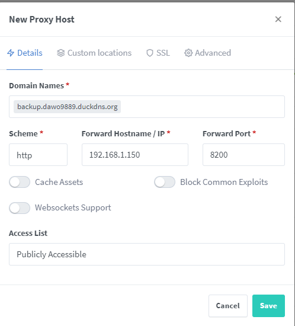

**Dokumentacja z etapu tworzenia swojego własnego, małego home laba**

<p style="text-align: center;">
Dokumentacja zawiera wszystkie etapy tworzenia osobistego, taniego Home Laba, który na początku miał służyć tylko pod nauke, jednak po wdrożeniu okazało się to idealne narzędzie do użytku codziennego, co może ułatwić pracę wielu osobom. Przez home lab mam na myśli urządzenie czynne przez 24h/7, na którym będą uruchomione liczne usługi.

Dokumentacja może być trochę rozbudowana, zależy mi na tym, aby dzięki niej, krok po kroku odbudować system w razie potrzeby. Jednocześnie chcę, aby była w postaci sprawozdania z etapu tworzenia.

</p>


- [1. Hardware](#1-hardware)
  - [1.1. Terminal](#11-terminal)
  - [1.2. Antena Zigbee](#12-antena-zigbee)
- [2. Software](#2-software)
  - [2.1. OpenMediaVault](#21-openmediavault)
    - [2.1.1. Przygotowanie dysków](#211-przygotowanie-dysków)
    - [2.1.2. Portainer](#212-portainer)
  - [2.2. File Browser](#22-file-browser)
  - [2.3. Adguard](#23-adguard)
  - [2.4. Nginx Proxy Manager](#24-nginx-proxy-manager)
    - [2.4.1. Domena z certyfikatem](#241-domena-z-certyfikatem)
  - [2.5. Tailscale](#25-tailscale)
  - [2.6. NextCloud](#26-nextcloud)
  - [2.7. Immich](#27-immich)
    - [2.7.1. Backup danych](#271-backup-danych)
      - [2.7.1.1. Tworzenie backupu](#2711-tworzenie-backupu)
      - [2.7.1.2. Przywracanie danych z backupu](#2712-przywracanie-danych-z-backupu)
  - [2.8. Home Assistant](#28-home-assistant)
  - [2.9. Duplicati](#29-duplicati)


## 1. Hardware
### 1.1. Terminal
Wszystko zaczęło się od przeglądania promocji w internecie, aż znalazłem ciekawą, polecaną ofertę na terminal poleasingowy - **HP T630**. Terminal ten polecało sporo osób, więc uznałem, że to będzie dobry sprzęt pod naukę.
Co nieco ze specyfikacji mojego terminala:

|   Hardware |Opis  |
|---|---|
| Procesor  | AMD GX-420GI, 4 rdzenie  |
|  RAM |  8GB |
|  Dysk Systemowy  | 128GB NVMe  |
|   Dysk na dane |  500GB talerzowy WD Black |


Ten terminal oferuje naprawdę wiele możliwości, zwłaszcza gdy weźmiemy pod uwagę jego atrakcyjną cenę. Za około 160 zł otrzymujemy komputer, który dzięki dużej ilości pamięci RAM i wielordzeniowemu procesorowi pozwala na realizację szerokiego zakresu zadań.

Alternatywą może być Raspberry Pi, które choć niemal dwukrotnie droższe, charakteryzuje się niższym poborem energii. Wybór zależy więc od naszych potrzeb i priorytetów.

W moim przypadku terminal zużywa około 11 W w spoczynku i do 25 W przy maksymalnym obciążeniu. Przy założeniu średniego zużycia na poziomie 15 W, koszt jego rocznej, całodobowej pracy wynosi około 150 zł. To całkiem rozsądna kwota, biorąc pod uwagę jego możliwości i wszechstronność.


### 1.2. Antena Zigbee


Urządzenie, które będzie naszym masterem do komunikacji z urządzeniami po protokole zigbee. Będzie ono mi potrzebne do stworzenia automatyzacji w domu, o której będzie w dalszej części. Na razie antena jest wpięta pod urządzenie i tyle.


## 2. Software
W tej częsci zajmę się opisem oprogramowania, które wdrożyłem na swoim sprzęcie

### 2.1. OpenMediaVault
Głównym systemem zainstalowanym na tym sprzęcie jest OpenMediaVault, oprogramowanie typu open-source, które umożliwia łatwe zarządzanie udziałami sieciowymi i dyskami, które w przyszłości mogą zostać zintegrowane w macierz RAID.

Jednym z największych atutów OpenMediaVault jest jego prostota, która może być zarówno zaletą, jak i wadą. Z jednej strony, system nie oferuje tak wielu zaawansowanych opcji jak niektórzy konkurenci, co może być ograniczeniem dla bardziej zaawansowanych użytkowników. Z drugiej strony, dzięki minimalizmowi, OpenMediaVault jest niezwykle mało zasobożerny, co pozwala na wykorzystanie dostępnych zasobów na inne oprogramowanie. To sprawia, że system jest idealnym rozwiązaniem dla tych, którzy potrzebują lekkiego i wydajnego narzędzia do zarządzania danymi w domowej lub małej sieci.


Od razu po instalacji zmieniamy port z 80 na inny, który wiemy, że nie będzie nam potrzebny. Port 80 wykorzystamy później do proxy. W moim przypadku będzie to port 8000


#### 2.1.1. Przygotowanie dysków
Aby przygotować dysk do pracy należy w zakładce **Dyski > Systemy plików** utowrzyć system, tutaj możemy zdecydować z jakiego systemu chcemy skorzystać i ewentualnie wybrać macierz RAID do zastosowania.


#### 2.1.2. Portainer
Na początku musimy utworzyć jakieś katalogi, na których będziemy chcieli trzymać nasze wszystkie pliki z portainera


**docker** - tu bedziemy trzymać wszystko co związane z dockerem. Katalog jest na dysku, który później będzie w macierzy, wiec zwiekszy to jego dostępność.
**docker-compose** - katalog, którego podanie wymaga portainer w konfiguracji
**docker-dane** - Tak jak wyżej.


**Dodanie omv-extras**:

Uprzednio upewnijmy się czy mamy zainstalowane na debianie

Łączymy sie po ssh z naszą maszyną i wykonujemy te polecenia na użytkowniku z uprawnieniami sudo:

**wget, sudo, curl**
```bash
wget -O - https://github.com/OpenMediaVault-Plugin-Developers/packages/raw/master/install | bash
```
Teraz pojawi nam się nowa zakładka **omv-extras** w zakładce system. Uruchamiamy dockera i uruchamiamy ponownie system.


Teraz możemy zainstalować portainer. Zeby to zrobić przechodzimy do zakładki **Usługi>Compose>konfiguracja**


Teraz w zakładce **Uslugi>Compose>Pliki** możemy utworzyć plik pod portainer. Do tego możemy wykorzystać przykładowy szablon z przycisku dodaj, albo wykrozystać plik compose:

> [docker-compose dla portainer](Containers/Portainer/docker-compose.yaml)


Wystaczy założyć konto i możemy sie logować.
Teraz większość pracy z kontenerami będziemy mogli wykonywać za pomocą tego narzędzia.


### 2.2. File Browser
Aplikacja ta pozwoli nam na sprawniejsze poruszanie się po katalogach i ich zarządzanie, ułatwi nam również na tworzenie prostych plików tekstowych.

Aby ją zainstalować z poziomu portainer, wchodzimy na **App Templates** i wybieramy nasza aplikacje, jak widać mamy tu wiele do wyboru


Jednocześnie, aby nam to działało musimy skorzystać z zaawansowanych opcji i ustalić port, na którym aplikacja będzie dostępna i utworzyć bind mount, który pozwoli na dostęp do naszych katalogów z poziomu kontenera


### 2.3. Adguard
Przed instalacją trzeba wyłączyć demona "systemd-resolved", aby zwolnić port 53/udp:

```
sudo systemctl stop systemd-resolved
sudo systemctl disable systemd-resolved.service
sudo reboot
```
> [docker-compose dla adguard](Containers/Adguard/docker-compose.yaml)


AdGuard to serwer DNS z funkcją cache'owania, który umożliwia blokowanie uciążliwych reklam na poziomie całej sieci domowej. Dzięki temu wszystkie urządzenia podłączone do sieci mogą korzystać z ochrony przed reklamami, bez konieczności instalowania dodatkowego oprogramowania na każdym z nich. Domyślna konfiguracja AdGuard zapewnia już solidną ochronę, ale możemy zwiększyć jej skuteczność, "dokarmiając" serwer większą bazą danych, na przykład dostosowaną do polskich realiów.

AdGuard działa na zasadzie blokowania domen, co pozwala nie tylko na eliminację reklam, ale także na wprowadzenie kontroli rodzicielskiej, ograniczając dostęp do podejrzanych stron. Aby to skonfigurować, wystarczy ustawić AdGuard jako serwer DNS dla całej sieci, co można zrobić bezpośrednio na routerze. Dzięki temu każde urządzenie w naszej sieci automatycznie korzysta z ochrony oferowanej przez AdGuard, zapewniając większe bezpieczeństwo i wygodę użytkowania.


Dodajemy nasz adres adguarda w konfiguracji dhcp na routerze. Teraz kazde urządzenie w sieci będzie z tego adresu korzystać i dzięki temu będzie miało blokowane reklamy.


### 2.4. Nginx Proxy Manager
Dzięki temu proxy, będziemy mogli przekierować ruch na określone urządzenia. W nim zdefiniujemy przepisanie nazw domenowch na określony adres i port. Dzięki temu będziemy mogli, po wpisaniu w przeglądarce na przykład: `dawid.example.com` dostać się na serwer o ip: 192.168.1.150:8000.

W tworzeniu kontenera kluczowe jest zostawienie domyślnych portów, bo teraz jakikolwiek ruch na porcie 80 lub 443 zostanie obsłużony przez nasze proxy.
> [docker-compose dla nginx proxy manager](Containers/NPM/docker-compose.yaml)

Po uruchomieniu kontenera musimy skonfigurować konto administratora i jesteśmy gotowi do dalszej pracy. Teraz skonfigurujemy sobie domene z certyfikatem samopodpisanym

#### 2.4.1. Domena z certyfikatem
Domena będzie tylko do użytku domowego, nie będzie ona publicznie dostępna. Niestety takie domeny kosztują, a na razie chcemy się zabawić jak najniższym kosztem.

Do tego bardzo pomocna będzie nam strona [duckdns.com](https://www.duckdns.org/). Na niej możemy się zalogować i tam utworzyć nasz wpis domeny.

Wymyślamy sobie nazwę domeny i wskazujemy na nasz serwer. Jednocześnie możemy skopiować token, przyda nam się na przyszłość.


Teraz w naszym adguardzie dodajemy wpis do przepisywania domen. Wskazujemy wildcard i adres na który mają iść zapytania.


Teraz niezależnie od początku domeny, każde zapytanie będzie przesyłane na adres 192.168.1.150


Dzięki niekomercyjnemu urzędowi certyfikacji [Let's Encrypt](https://letsencrypt.org/pl/), możemy łatwo wygenerować certyfikat SSL dla naszych usług. Chociaż nie jest to zawsze konieczne, to jednak niektóre aplikacje, jak na przykład desktopowa wersja Nextcloud, wymagają połączenia przez HTTPS.

Istnieje wiele sposobów na uzyskanie certyfikatu Let's Encrypt, niektóre są prostsze, inne wymagają nieco więcej zaawansowania. Ja zdecydowałem się skorzystać z gotowego mechanizmu w nginx. Dzięki wykorzystaniu domeny na DuckDNS, możemy użyć naszego tokena do uwierzytelnienia się u dostawcy domeny, co umożliwia potwierdzenie jej własności i wygenerowanie certyfikatu SSL.

To rozwiązanie zapewnia dodatkowe bezpieczeństwo dla naszych usług, chroniąc komunikację przed potencjalnymi zagrożeniami i spełniając wymagania aplikacji, które wymagają bezpiecznego połączenia.

Przechodzimy do nginx do zakladki **SSL Certificates** a następnie **Add SSL Certificate i wybieramy Let's Encrypt**

Teraz wybieramy naszą domene, którą określiliśmy w duckdns i jednocześnie wpisujemy domene wildcard. Pozwoli nam to wykorzystać jeden certyfikat do wszystkich domen z domeną główną **dawo9889.duckdns.org**


W miejsce tokenu wklejamy skopiowany z duckdns token, następnie ustawiany sekundy propagacji na troche więcej.

**!!UWAGA!! Czasami trzeba spróbować wygenerować parę razy, bo za pierwszym może nie działać**


Teraz na głównej stronie możemy dodać naszego hosta, aby to zrobić musimy wymyśleć poddomene do naszej glównej domeny. W tym przpadku będzie to **backup.dawo9889.duckdns.org**, następnie nakręślamy, na jaki adres i jaki port ma wskazywać nasza domena.



Następnie wybieramy nasz certyfikat:


Tak naprawdę to już wszystko. Teraz w przeglądarce możemy wpisać nasz adres i nasze proxy powinno przekierować nas na określoną usługę. W moim przypadku nakieruje mnie na usługę Duplicati - o której trochę więcej będzie później.

Tak wygląda stan hostów w proxy na 20.08.2024:


### 2.5. Tailscale

Instalacje bardzo fajnie tłumaczy [dokumentacja od producenta](https://tailscale.com/download/linux/debian-bookworm)

Przede wszystkim zależy nam na dostępnie zdalnym z domu do naszego homelaba, aby to zrobić musimy skorzystać z jakiegoś vpna, do tego świetnie nada się tailscale. Jest bardzo prosty w obsludze, ale ma też swoje wady. Musimy utworzyć swoje konto, więc nasz ruch idzie przez serwery tailscale. W darmowej wersji również może być tylko jeden użytkownik.
Jednak dla mojego użytku jest to odpowiednie. Dlatego wykorzystam to rozwiązanie.

Na naszym terminalu musimy się podłączyć po ssh i wykonać pare poleceń:

```
curl -fsSL https://pkgs.tailscale.com/stable/debian/bookworm.noarmor.gpg | sudo tee /usr/share/keyrings/tailscale-archive-keyring.gpg >/dev/null
curl -fsSL https://pkgs.tailscale.com/stable/debian/bookworm.tailscale-keyring.list | sudo tee /etc/apt/sources.list.d/tailscale.list
```

Następnie:
```
sudo apt-get update
sudo apt-get install tailscale
```
Teraz włączamy usługe, którą musimy uwierzytelnić przez przeglądarkę (Musimy dać dostęp do naszego konta tailscale)
```
sudo tailscale up
```

Następnie, chcemy określić nasz terminal jako router, do tego musimy wykonać te [polecenia](https://tailscale.com/kb/1406/quick-guide-subnets)

Dodatkowo wskazujemy tailscale, że nasz terminal może być węzłem wyjściowym. Dzięki temu będziemy mogli wychodzić do internetu właśnie przez niego:

[Wskazanie terminala jako węzła wyjściowego](https://tailscale.com/kb/1103/exit-nodes?tab=linux)

Na koniec musimy w panelu administratora tailscale na przeglądarce zatwierdzić ustawienia. Nie powinno to byc trudne, bo wyskakują od tego powiadomienia.


Aby wszystko działo poprawnie jeszcze musimy w zakładce DNS wskazać nasz terminal z adguardem jako dostawce dns.


Teraz możemy wykorzystać naszego vpna do bezpiecznego przeszukiwania internetu :) Wystarczy, że na każdym urządzeniu, z którego chcemy się łączyć zainstalujemy klienta i go skonfigurujemy.
Jednoczesnie mamy teraz dostęp do naszego terminala.

Tu moje publiczne ip przed połączeniem vpn:


Tu publiczny adres ip po podłączeniu:


### 2.6. NextCloud
Nextcloud to potężna alternatywa dla popularnych usług chmurowych oferowanych przez firmy takie jak Google czy Microsoft. W przeciwieństwie do komercyjnych rozwiązań, Nextcloud daje pełną kontrolę nad danymi, umożliwiając hostowanie własnej chmury na serwerze lokalnym lub zdalnym. To oprogramowanie open-source pozwala na synchronizację plików pomiędzy różnymi urządzeniami, co oznacza, że wszystkie Twoje dokumenty, zdjęcia i inne pliki są zawsze dostępne i aktualne na komputerze, smartfonie czy tablecie.

Nextcloud oferuje szeroką gamę funkcji, które wychodzą poza samą synchronizację plików. Możemy tu znaleźć narzędzia do zarządzania kalendarzem, kontaktami, notatkami, a także aplikacje do współpracy, takie jak edytory dokumentów, czaty czy wideokonferencje.

Jednym z największych atutów Nextcloud jest jego elastyczność. Można go łatwo rozbudować o dodatkowe funkcje za pomocą wtyczek, dostosowując chmurę do swoich specyficznych potrzeb. Ponadto, dzięki pełnej kontroli nad infrastrukturą, mamy pewność, że Twoje dane pozostają prywatne i zabezpieczone przed dostępem osób trzecich, co jest kluczowe w erze rosnącej świadomości na temat ochrony prywatności.


Tak samo jak w kontenerach powyżej, musimy okreslić gdzie chcemy nasze dane przetrzymywać itp.

> [docker-compose.yaml dla nextcloud](containers/Nextcloud/docker-compose.yaml)
Do działania musimy zdefiniować zmienne środowiskowe dla naszej aplikacji. Są to ważne dane poufne, więc nie zapomnijmy ich gdzies zapisać, na przykład w menadżerze haseł.

>[Example.env dla nextcloud](containers/Nextcloud/example.env)

Po uruchomieniu kontenerów, możemy utworzyć użytkownika i już się bawić naszą chmurą. Jednak jakbyśmy chcieli korzystać z połączenia po https, musimy zrobić parę dodatkowych rzeczy:

Musimy edytować plik **app/config/config.php** i dodać/edytować parę wpisów do niego:

```php
'trusted_domains' =>
  array (
    0 => '192.168.1.150:8080',
    1 => 'cloud.dawo9889.duckdns.org'
  ),
'overwrite.cli.url' => 'https://cloud.dawo9889.duckdns.org',
'overwriteprotocol' => 'https'
```
Następnie uruchamiamy ponownie kontener i wszystko powinno już działać. Teraz możemy bezproblemowo łączyć się za pomoca klienta desktopowego i aplikacji w telefonie.

### 2.7. Immich
Immich to doskonała alternatywa dla aplikacji takich jak Google Photos, oferująca zaawansowane funkcje zarządzania i przeglądania zdjęć. Choć zdjęcia można by przechowywać na Nextcloudzie i przeglądać je za pomocą aplikacji "Memories", Immich wyróżnia się szeregiem funkcji, które są bardziej dedykowane zarządzaniu fotografiami.

Jedną z kluczowych zalet Immich jest automatyczne generowanie miniaturek, co znacznie przyspiesza przeglądanie dużych bibliotek zdjęć. Aplikacja oferuje również zaawansowane funkcje, takie jak wykrywanie twarzy, które umożliwia łatwe grupowanie zdjęć według osób, oraz indeksowanie zdjęć według daty, co ułatwia organizowanie i wyszukiwanie konkretnych wspomnień.

Ze względu na te funkcje, zdecydowałem się na Immich jako rozwiązanie dedykowane głównie do zarządzania zdjęciami. Daje mi to większą kontrolę i lepsze narzędzia do pracy z moją kolekcją fotografii, niż to, co oferuje Nextcloud w tej dziedzinie.

Do samej instalacji mocno polecam [dokumentacje producenta](https://immich.app/docs/install/docker-compose), która jest dla mnie jasna i klarowna.

> [docker-compose.yaml](containers/Immich/docker-compose.yaml)
> [plik ze zmiennymi środowiskowymi](containers/Immich/example.env)
Oczywiście pamiętajmy, że zmienne środowiskowe powinny być poufne, a haslo do bazy danych zapisać gdzieś w menadżerze haseł.

Teraz możemy się cieszyć z własnej chmury do przetrzymywania zdjęć :)


#### 2.7.1. Backup danych
##### 2.7.1.1. Tworzenie backupu
Z doświadczenia wiem, że zamiast po prostu kopiować pliki, lepiej jest wykonać backup z [dokumentacji programu](https://immich.app/docs/administration/backup-and-restore)

W docker-compose powyżej jest już określony kontener do backupu, który w moim przypadku każdego dnia o północy będzie wykonywał backup bazy danych immich.
Jednak jakbyśmy chcieli wykonać backup manualnie możemy użyc polecenia:
``` sh
docker exec immich_db_dumper ./backup.sh
```

##### 2.7.1.2. Przywracanie danych z backupu
Teraz, gdy chcemy przywrócić dane, wystarczy że wykonamy skrypt w tym samym folderze, gdzie jest folder z backupem:

**restore_backup.sh:**
``` sh
#!/bin/bash

# Ostrzeżenie: Usuwa wszystkie dane Immich, aby rozpocząć od nowa.
docker compose down -v

# Ostrzeżenie: Usuwa wszystkie dane Immich, aby rozpocząć od nowa.
rm -rf /postgres

# Aktualizuje do najnowszej wersji Immich (jeśli jest to pożądane).
#docker compose pull

# Tworzy kontenery Docker dla aplikacji Immich bez ich uruchamiania.
docker compose create

# Uruchamia serwer Postgres.
docker start immich_postgres

# Czeka 10 sekund, aby dać czas na uruchomienie serwera Postgres.
sleep 10

# Przywraca kopię zapasową bazy danych z pliku .sql.gz, modyfikując ją przed załadowaniem.
gunzip < db_dumps/last/immich-latest.sql.gz \
| sed "s/SELECT pg_catalog.set_config('search_path', '', false);/SELECT pg_catalog.set_config('search_path', 'public, pg_catalog', true);/g" \
| docker exec -i immich_postgres psql --username=postgres

# Uruchamia pozostałe aplikacje Immich.
docker compose up -d
```

**!!!UWAGA!!! Backup nie uwzględnia miniaturek, danych z wykrywania twarzy itp. Jeżeli pliki zostaną uszkodzone i abckup zostanie przywrócony, wszystkie te rzeczy program musi zrobić na nowo**

### 2.8. Home Assistant

Home Assistant to aplikacja, która pozwala na pełną automatyzację naszego domu, kładąc szczególny nacisk na kontrolę i prywatność mieszkańców. Dzięki temu wszystkie dane są przechowywane lokalnie, w naszej własnej chmurze, co eliminuje ryzyko ich wysyłania na zewnętrzne serwery. Takie podejście nie tylko zapewnia większe bezpieczeństwo, ale także gwarantuje ciągłość działania systemu. W przeszłości zdarzało się, że duzi producenci porzucali swoje rozwiązania, gdy przestały być dla nich opłacalne, co skutkowało brakiem wsparcia dla ich serwerów. Z Home Assistant ten problem nie istnieje.

Jednym z kluczowych elementów automatyzacji jest protokół Zigbee, który dynamicznie się rozwija. Zapewnia on niskie zużycie energii oraz wspiera różne topologie sieci, w tym topologię mesh, która pozwala na rozległe połączenia między urządzeniami. Co ważne, sygnały przesyłane przez Zigbee są szyfrowane, co dodatkowo podnosi poziom bezpieczeństwa.

Aby korzystać z Zigbee, potrzebna jest bramka, którą wcześniej prezentowałem. Jej koszt na polskim rynku wynosi około 70 zł. Bramka ta jest kluczowym elementem komunikacji z naszymi urządzeniami. Jeśli jednak zasięg okaże się niewystarczający, wiele urządzeń, takich jak inteligentne gniazdka, może pełnić rolę repeatera, wzmacniając sygnał.

Dopiero rozpoczynam swoją przygodę z tym systemem. Zakupiłem urządzenia do domu rodzinnego, ponieważ wcześniej testowane rozwiązania zdalnego zarządzania zasilaniem często zawodziły, nawet przy dobrym zasięgu sieci Wi-Fi.


> [docker-compose.yaml dla Home Assistant](containers/Home%20Assistant/docker-compose.yaml)

``` yaml
  devices:
      - /dev/ttyUSB0:/dev/ttyUSB0
```
Tu musimy znaleźć podpiętą naszą bramke i przekazać ją do kontenera

Nasz HA będzie już działać, ale jeżeli chcemy ustawić do tego https, musimy wykonać parę dodatkowych kroków.
W nginx proxy manager, przy dodawaniu hosta, musimy w zakładce **custom locations** dodać taki wpis:


Następnie w konfiguracji HA, w pliku **config/configuration.yaml** dodać taki wpis:
```yaml
http:
  use_x_forwarded_for: true
  trusted_proxies:
    - 172.21.0.2   # see EDIT below
    - 127.0.0.1
    - ::1
```
gdzie `172.21.0.2` to adres sieci, w której znajduje się nasz kontener z nginx proxy manager. Znajdziemy to z łatwością za pomocą portainer.


### 2.9. Duplicati

Jeśli chodzi o backup całego dysku z danymi, w tym z danymi z kontenerów, idealnym narzędziem do tego zadania jest Duplicati. Jest to wyjątkowo proste, ale jednocześnie skuteczne rozwiązanie do tworzenia kopii zapasowych.

Duplicati oferuje wiele przydatnych funkcji, które sprawiają, że jest to niezawodna opcja do ochrony danych. Można go skonfigurować do tworzenia regularnych backupów, które są kompresowane i szyfrowane, co zapewnia bezpieczeństwo przechowywanych informacji. Dodatkowo, Duplicati obsługuje różne miejsca docelowe dla backupów, w tym lokalne dyski, sieciowe zasoby, a także popularne chmury, takie jak Google Drive czy Amazon S3.

Jedną z największych zalet Duplicati jest jego prostota. Interfejs użytkownika jest intuicyjny i łatwy w obsłudze, co sprawia, że konfiguracja i zarządzanie backupami nie wymaga specjalistycznej wiedzy technicznej. To czyni Duplicati idealnym rozwiązaniem dla osób, które szukają niezawodnego i prostego w obsłudze narzędzia do zabezpieczenia swoich danych.

>[docker-compose.yaml dla duplciati](containers/Duplicati/docker-compose.yaml)
Tu ważne, aby wskazać folder na dysku, od którego duplicati mógłby zacząć widzieć pliki do backupu. To już wynika ze sepcyfiki kontenerów.

Gdy już uruchomimy dupliacti możemy stworzyć swój pierwszy plan backupowy.


Następnie wskazujemy miejsce docelowe backupu. Tu duplicati oferuje bardzo dużo możliwości, a uwierzytelnienie się do swojego dysku w chmurze jest bardzo łatwe.


Teraz możemy wskazać nasze dane do backupu. Dzięki temu, że wskazaliśmy cały dysk, mozemy zanzaczyć cały katalog source, który jest podmontowany do całego dysku.


Następnie ustalamy harmonogram.


Teraz możemy ustalić polityke naszych backupów. Tu możemy ustalić ile wersji plików w tył backup ma przetrzymywać.


I tak naprawdę to wszystko, teraz możemy poczekać aż backup wykona się automatycznie o określonych wcześniej w harmonogramie godzinach, lub wykonać go ręcznie.
Przywracanie danych jest również bardzo proste, bo wszystko dzieje się automatycznie. Dupliacti zapamiętuje strukture folderów itp. Wystarczy odtworzyć strukture folderów, które wskazywaliśmy w woluminach.
